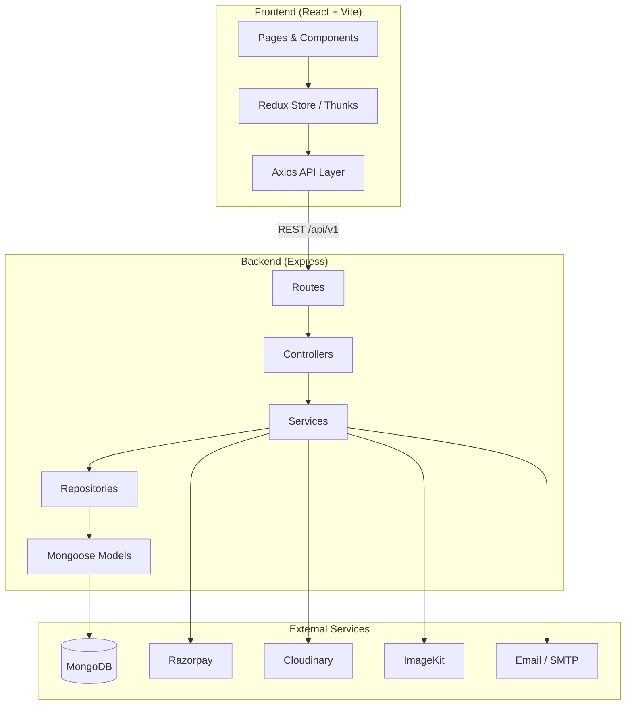

# LMS — Learning Management System

A full-stack Learning Management System built with the MERN stack. LMS enables students to browse, purchase, and complete online courses; instructors to create and manage course content; and administrators to oversee users, courses, orders, and platform analytics.

---

## Overview

LMS is a production-oriented e-learning platform that supports role-based access for **students**, **instructors**, and **admins**. The application covers the complete course lifecycle—from creation and curriculum management to payment, enrollment, video playback, and progress tracking.

The project is organized as a monorepo with separate **frontend** (React + Vite) and **backend** (Node.js + Express) applications communicating over a REST API.

**Live frontend:** [lms-frontend-phi-pied.vercel.app](https://lms-frontend-phi-pied.vercel.app)

**Repository:** [github.com/umakantkatare/LMS](https://github.com/umakantkatare/LMS)

---

## Features

### Authentication & Users
- User registration and login with JWT access tokens and HTTP-only refresh cookies
- Role-based authorization (`student`, `instructor`, `admin`)
- Profile management with avatar upload
- Password change, forgot password, and reset password via email
- Automatic token refresh with Axios interceptors

### Courses & Curriculum
- Create, update, publish, and unpublish courses
- Multi-section curriculum with ordered lectures
- Course thumbnails, promo videos, pricing, and discount support
- Free and paid course options
- Slug-based course URLs and full-text search indexing

### Learning Experience
- Course catalog and detailed course pages
- Video lecture player with progress tracking
- Mark lectures complete and resume from last watched position
- Course reviews and ratings

### Payments & Enrollment
- Razorpay integration for secure payments
- Order history and payment verification
- Automatic enrollment after successful payment
- Free course enrollment support

### Instructor Tools
- Instructor dashboard and course management
- Section and lecture CRUD with reordering
- Cloudinary signed uploads for video content
- ImageKit integration for media handling

### Admin Panel
- Platform dashboard and analytics
- User management (role and status updates)
- Course and order oversight

### Additional
- Contact page
- Responsive UI with dark mode support (via shadcn/ui)
- Structured logging with Winston
- Input validation with Joi (backend) and Zod (frontend)

---

## Tech Stack

| Layer | Technologies |
|-------|-------------|
| **Frontend** | React 19, Vite 8, React Router 7, Redux Toolkit, Tailwind CSS 4, shadcn/ui, Axios, React Hook Form, Zod, Framer Motion |
| **Backend** | Node.js, Express 5, MongoDB, Mongoose |
| **Authentication** | JWT, bcrypt, HTTP-only cookies |
| **Payments** | Razorpay |
| **Media Storage** | Cloudinary, ImageKit |
| **Email** | Nodemailer (SMTP / Google OAuth) |
| **Dev Tools** | ESLint, Nodemon, Morgan, Winston |

---

## Architecture

The application follows a **client–server architecture** with a layered backend and feature-based frontend.



### Backend Layers

| Layer | Responsibility |
|-------|----------------|
| **Routes** | Define API endpoints and apply middleware |
| **Controllers** | Handle HTTP requests and responses |
| **Services** | Business logic and orchestration |
| **Repositories** | Database access and queries |
| **Models** | Mongoose schemas and data validation |
| **Middlewares** | Auth, role checks, validation, error handling |

### Frontend Structure

| Layer | Responsibility |
|-------|----------------|
| **Pages** | Route-level views |
| **Components** | Reusable UI and feature components |
| **Features** | Redux slices and async thunks per domain |
| **API** | Axios instance with auth interceptors |
| **Hooks** | Shared logic (auth, enrollment, payments) |

---

## Folder Structure

```
LMS/
├── backend/
│   ├── src/
│   │   ├── configs/          # DB, email, payment, Cloudinary, ImageKit
│   │   ├── constants/
│   │   ├── controllers/      # Request handlers
│   │   ├── middlewares/      # Auth, roles, validation, multer, errors
│   │   ├── models/
│   │   │   └── nosql/          # Mongoose schemas (User, Course, etc.)
│   │   ├── repositories/     # Data access layer
│   │   ├── routes/             # API route definitions
│   │   ├── services/           # Business logic
│   │   ├── utils/              # JWT, email, logger, helpers
│   │   └── validations/        # Joi schemas
│   ├── logs/
│   ├── Dockerfile
│   ├── package.json
│   └── server.js
│
└── frontend/
    ├── public/
    ├── src/
    │   ├── api/                # Axios client and API modules
    │   ├── app/                # Redux store configuration
    │   ├── components/         # UI, layout, course, dashboard components
    │   ├── constants/
    │   ├── features/           # auth, course, enrollment, upload, user
    │   ├── hooks/
    │   ├── layouts/
    │   ├── pages/              # auth, course, student, instructor, dashboard
    │   ├── routes/             # React Router config and guards
    │   └── utils/
    ├── index.html
    ├── vite.config.js
    └── package.json
```

---

## Installation

### Prerequisites

- [Node.js](https://nodejs.org/) v18 or higher
- [MongoDB](https://www.mongodb.com/) (local or Atlas)
- Accounts for [Razorpay](https://razorpay.com/), [Cloudinary](https://cloudinary.com/), and [ImageKit](https://imagekit.io/) (for full functionality)

### Clone the Repository

```bash
git clone https://github.com/umakantkatare/LMS.git
cd LMS
```

### Backend Setup

```bash
cd backend
npm install
```

Create a `.env` file in the `backend/` directory (see [Environment Variables](#environment-variables)).

### Frontend Setup

```bash
cd frontend
npm install
```

Create a `.env` file in the `frontend/` directory (see [Environment Variables](#environment-variables)).

---

## Environment Variables

### Backend (`backend/.env`)

| Variable | Description |
|----------|-------------|
| `PORT` | Server port (default: `5000`) |
| `NODE_ENV` | Environment (`development` / `production`) |
| `MONGO_URI` | MongoDB connection string |
| `JWT_SECRET` | Secret for access tokens |
| `JWT_EXPIRE` | Access token expiry (e.g. `15m`) |
| `JWT_REFRESH_SECRET` | Secret for refresh tokens |
| `JWT_REFRESH_EXPIRE` | Refresh token expiry (e.g. `7d`) |
| `CLIENT_URL` | Frontend URL (used in password reset links) |
| `RAZORPAY_KEY_ID` | Razorpay API key ID |
| `RAZORPAY_KEY_SECRET` | Razorpay API key secret |
| `CLOUDINARY_CLOUD_NAME` | Cloudinary cloud name |
| `CLOUDINARY_API_KEY` | Cloudinary API key |
| `CLOUDINARY_API_SECRET` | Cloudinary API secret |
| `IMAGEKIT_PUBLIC_KEY` | ImageKit public key |
| `IMAGEKIT_PRIVATE_KEY` | ImageKit private key |
| `IMAGEKIT_URL_ENDPOINT` | ImageKit URL endpoint |
| `SMTP_HOST` | SMTP server host |
| `SMTP_PORT` | SMTP server port |
| `SMTP_EMAIL` | Sender email address |
| `SMTP_PASSWORD` | SMTP password |
| `GOOGLE_CLIENT_ID` | Google OAuth client ID (optional) |
| `GOOGLE_CLIENT_SECRET` | Google OAuth client secret (optional) |
| `GOOGLE_REFRESH_TOKEN` | Google OAuth refresh token (optional) |
| `GOOGLE_USER` | Google account email (optional) |

### Frontend (`frontend/.env`)

| Variable | Description |
|----------|-------------|
| `VITE_BASE_URL` | Backend API base URL (e.g. `http://localhost:5000/api/v1`) |
| `VITE_RAZORPAY_KEY_ID` | Razorpay public key for checkout |

---

## Running the Project

### Development

Start the backend and frontend in separate terminals:

```bash
# Terminal 1 — Backend
cd backend
npm run dev

# Terminal 2 — Frontend
cd frontend
npm run dev
```

| Service | URL |
|---------|-----|
| Frontend | http://localhost:5173 |
| Backend API | http://localhost:5000/api/v1 |

### Production Build

```bash
# Frontend
cd frontend
npm run build
npm run preview

# Backend
cd backend
npm start
```

### Docker (Backend)

```bash
cd backend
docker build -t lms-backend .
docker run -p 5000:5000 --env-file .env lms-backend
```

---

## API Overview

Base URL: `/api/v1`

| Module | Endpoint | Method | Access | Description |
|--------|----------|--------|--------|-------------|
| **Auth** | `/auth/register` | POST | Public | Register a new user |
| | `/auth/login` | POST | Public | Login |
| | `/auth/logout` | POST | Auth | Logout |
| | `/auth/me` | GET | Auth | Get current user |
| | `/auth/refresh-token` | POST | Public | Refresh access token |
| | `/auth/change-password` | PATCH | Auth | Change password |
| | `/auth/forgot-password` | POST | Public | Request password reset |
| | `/auth/reset-password/:token` | POST | Public | Reset password |
| **User** | `/user/profile` | GET / PATCH | Auth | View / update profile |
| | `/user/avatar` | PATCH | Auth | Update avatar |
| | `/user/account` | DELETE | Auth | Delete account |
| | `/user/dashboard` | GET | Auth | User dashboard data |
| **Course** | `/course/published` | GET | Public | List published courses |
| | `/course/all` | GET | Public | List all courses |
| | `/course/:slug` | GET | Public | Get course by slug |
| | `/course/id/:id` | GET | Public | Get course by ID |
| | `/course/create` | POST | Instructor | Create course |
| | `/course/instructor/my-courses` | GET | Instructor | Instructor's courses |
| | `/course/:id` | PUT / DELETE | Instructor | Update / delete course |
| | `/course/:id/publish` | PATCH | Instructor | Publish course |
| | `/course/:id/unpublish` | PATCH | Instructor | Unpublish course |
| **Section** | `/section/course/:courseId` | GET | Public | Sections for a course |
| | `/section/course/:courseId` | POST | Instructor | Create section |
| | `/section/:id` | GET / PATCH / DELETE | Mixed | Section CRUD |
| | `/section/reorder` | PATCH | Instructor | Reorder sections |
| **Lecture** | `/lecture/section/:sectionId` | GET | Public | Lectures in a section |
| | `/lecture/course/:courseId` | POST | Instructor | Create lecture |
| | `/lecture/:id` | GET / PUT / DELETE | Mixed | Lecture CRUD |
| | `/lecture/reorder` | PATCH | Instructor | Reorder lectures |
| **Upload** | `/upload/sign-video` | POST | Instructor | Get signed video upload URL |
| | `/upload/:publicId` | DELETE | Instructor | Delete uploaded file |
| **Payment** | `/payment/create-order` | POST | Auth | Create Razorpay order |
| | `/payment/verify` | POST | Auth | Verify payment signature |
| **Order** | `/order/my-orders` | GET | Auth | User order history |
| | `/order/:id` | GET | Auth | Order details |
| **Enrollment** | `/enrollment/:courseId` | POST / GET | Auth | Enroll / check enrollment |
| | `/enrollment/my-courses` | GET | Auth | Enrolled courses |
| **Progress** | `/progress/:courseId` | GET | Auth | Course progress |
| | `/progress/complete` | POST | Auth | Mark lecture complete |
| | `/progress/resume/:courseId` | PATCH | Auth | Update resume position |
| **Review** | `/review/course/:courseId` | GET | Public | Course reviews |
| | `/review/:courseId` | POST | Auth | Submit review |
| | `/review/:id` | PUT / DELETE | Auth | Update / delete review |
| **Admin** | `/admin/dashboard` | GET | Admin | Admin dashboard |
| | `/admin/users` | GET | Admin | List all users |
| | `/admin/user/:id/role` | PATCH | Admin | Update user role |
| | `/admin/user/:id/status` | PATCH | Admin | Update user status |
| | `/admin/courses` | GET | Admin | List all courses |
| | `/admin/course/:id` | DELETE | Admin | Delete course |
| | `/admin/orders` | GET | Admin | List all orders |
| | `/admin/analytics` | GET | Admin | Platform analytics |

> **Auth** = requires valid JWT. **Instructor** = instructor or admin role. **Admin** = admin role only.

---

## Deployment

### Frontend (Vercel)

1. Connect the repository to [Vercel](https://vercel.com/).
2. Set the root directory to `frontend`.
3. Configure build command: `npm run build`
4. Set output directory: `dist`
5. Add environment variables (`VITE_BASE_URL`, `VITE_RAZORPAY_KEY_ID`).

### Backend

The backend includes a `Dockerfile` for containerized deployment. Deploy to any Node.js hosting platform (Railway, Render, AWS, DigitalOcean, etc.).

1. Set all backend environment variables on the host.
2. Ensure `CLIENT_URL` points to the deployed frontend URL.
3. Update CORS origins in `backend/src/app.js` to include your production frontend domain.
4. Use `npm start` for production (not `npm run dev`).

---

## Screenshots

> Add screenshots of your application below.

| Home Page | Course Catalog |
|-----------|----------------|
|  |  |

| Course Player | Instructor Dashboard |
|---------------|---------------------|
|  |  |

---

## Future Improvements

- [ ] Email verification on registration
- [ ] Certificate generation on course completion
- [ ] Live classes and real-time chat
- [ ] Advanced search and filtering (category, price, rating)
- [ ] Instructor analytics dashboard
- [ ] Coupon and discount code system
- [ ] Multi-language UI support
- [ ] Mobile application (React Native)
- [ ] Unit and integration test coverage
- [ ] CI/CD pipeline with GitHub Actions

---

## License

This project is licensed under the [ISC License](https://opensource.org/licenses/ISC).

---

## Author

**Umakant Katare**

- GitHub: [@umakantkatare](https://github.com/umakantkatare)
- Email: umakantkatare11@gmail.com

---

<p align="center">Built with ❤️ using the MERN stack</p>
